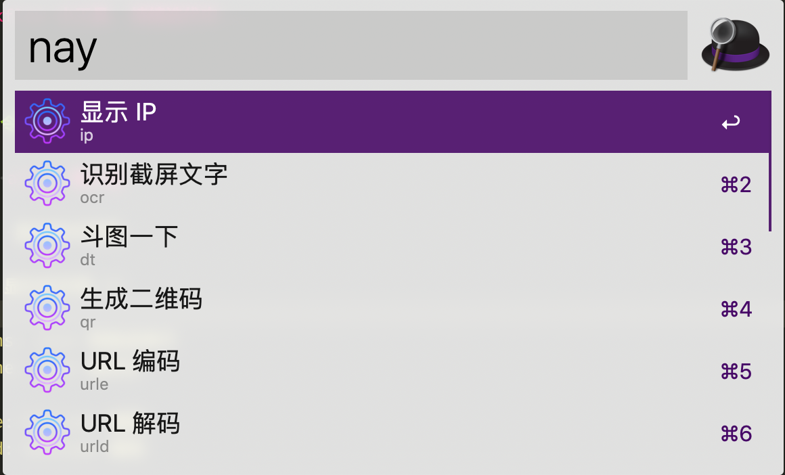
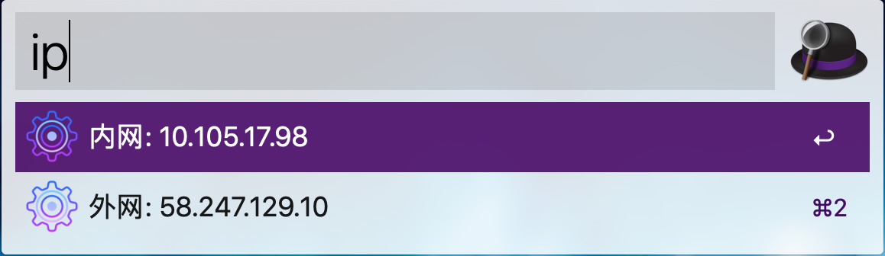
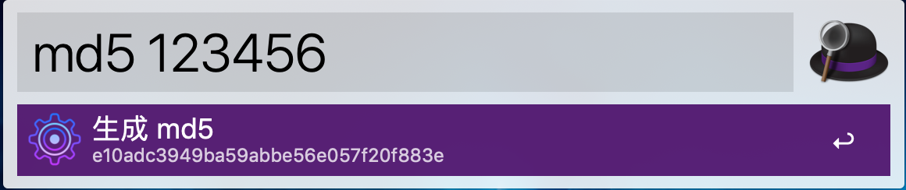
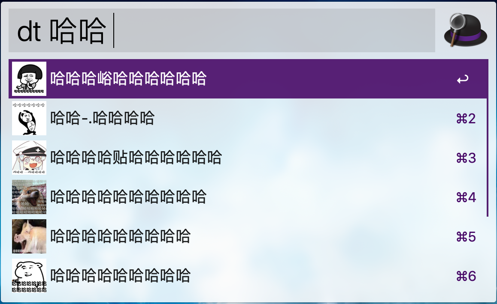
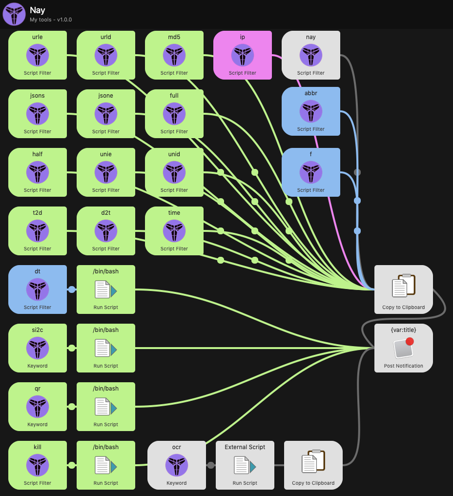

# alfred-workflow-nay

> workflow 个人小工具, 持续迭代中...

---

### 使用帮助

```
在 workflow 列表中, 选中 Nay, 右键: Open in Finder 会进入应用代码目录

应用使用脚本语言有 python, php, shell等, 故需要对应环境方可使用

python3 版本需安装相应模块
终端进入应用目录下: pip install -r requirements.txt

触发器中示例语法:
/usr/local/bin/python ./src/nay.py "unie" "{query}"

任一指令回车后都会将结果写入剪切板, 方便直接粘贴使用, 并弹出提示框

如果有功能无法正常使用:
1. 进入 workflow 列表
2. 选中 Nay 应用
3. 点击右上角 bug 图标, 进入调试模式
4. 使用功能, 观察输出框报错..

Attension:
当前应用本人仅 Mac 环境亲测

PPSS:
快照中:
绿色为 python 脚本实现
红色为 shell 脚本实现
蓝色为 php 脚本实现
白色为其他

```

---

### 命令菜单

> 打开 alfre 输入框...

#### nay: 显示命令列表


#### ip: 显示内外网 IP


#### jsons: Json 转换成单行

```
{
    "hello": "world"
}

=>

{"hello": "world"}
```

#### jsone: Json 格式化

```
{"hello": "world"}

=>

{
    "hello": "world"
}
```


#### unie: Unicode 编码

```
你好

=>

\u4f60\u597d
```

#### unid: Unicode 解码

```
\u4f60\u597d

=>

你好
```

#### half: 全角转半角

```
。，【】

=>

.,[]
```

#### full: 半角转全角

```
.,[]

=>

。，【】
```

#### urle: URL 编码

```
http://baidu

=>

http%3A//baidu
```

#### urld: URL 解码

```
http%3A//baidu

=>

http://baidu
```

#### time: 当前时间戳

```
1571394736
```

#### t2d: 时间戳转换为日期

```
1571394736

=>

2019-10-18 18:32:16
```

#### d2t: 日期转换为时间戳

```
2019-10-18 18:32:16

=>

1571394736
```


#### si2c: 图片复制到剪切板

```
本身是个内部功能, 方便斗图下载的表情包能复制到剪切板
也适用于直接复制远程图片地址到剪切板
```

#### qr: 生成二维码
```
输入待加密文本, 生成的二维码图片直接到剪切板
```
#### md5: 生成 md5



#### kill: 强杀进程


#### ocr: 图片文本识别

截图后, 打开 ocr, 回车后, 会自动请求百度 ocr 文字识别应用进行解析, 并将返回的文本直接复制到剪切板
目前使用的是我自己申请的 key
如果失效, 去 [百度云控制台](https://console.bce.baidu.com/ai/#/ai/ocr/overview/index) 申请开通文字识别的应用
替换掉配置里的 bce_api_key 和 bce_api_secret
如下为示例效果:


```
o Securing software together
Introducing new ways to identify and
prevent security vulnerabilities across your
code base
Explore repositories
angular/components
Component infrastructure and material design
components for Angular
● Type Script★18.9k
```

#### dt: 斗图

```
输入文字以空格结束, 会自动搜索表情包, 选中回车后自动复制到粘贴板
```



---

### 快照镇楼



---

### 链接

- ocr 功能是克隆 [alfred-clipboard-ocr](https://github.com/oott123/alfred-clipboard-ocr), 只是为了交互方便统一, 才移入当前应用中
- dt 斗图功能参考了 [斗图神器](https://github.com/KilluaChen/Dou-figure-alfred-workflow), 重写了图片处理相关逻辑和交互

---
